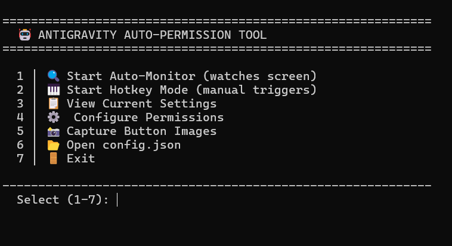

# 📖 Antigravity Auto-Permission Tool - User Manual

> Automatically handle Antigravity permission dialogs without clicking every time!

---

## 🚀 Quick Start

1. **Double-click** `AntigravityAutoPermit.exe`
2. Type **1** and press Enter to start auto-monitoring
3. The app will automatically click Accept/Confirm buttons for you!

---

## 📋 Main Menu Options



| Option | What It Does |
|--------|--------------|
| **1** | **Auto-Monitor** - Watches screen and clicks buttons automatically |
| **2** | **Hotkey Mode** - You press hotkeys to approve/deny |
| **3** | **View Settings** - See current permission rules |
| **4** | **Configure** - Change permission rules interactively |
| **5** | **Capture Buttons** - Take screenshots of new buttons |
| **6** | **Open Config** - Edit config.json directly |
| **7** | **Exit** - Close the application |

---

## 🔍 Option 1: Auto-Monitor Mode

This is the **main feature**. When running:

1. The app continuously scans your screen
2. When it finds a permission button (Accept, Confirm, etc.), it checks your rules
3. Based on your config, it automatically clicks the button

**To stop:** Press `Ctrl+C`

---

## 🎹 Option 2: Hotkey Mode

For manual control with keyboard shortcuts:

| Hotkey | Action |
|--------|--------|
| `Ctrl+Shift+Y` | Send **Accept** (Alt+Enter) |
| `Ctrl+Shift+N` | Send **Deny** (Escape) |
| `Ctrl+Shift+Q` | Quit hotkey mode |

---

## ⚙️ Option 4: Configure Permissions

Change how each permission type is handled:

```
For each permission, enter:
  a = Approve (auto-click Accept)
  d = Deny (auto-click Deny)
  s = Skip (do nothing, manual)
  Enter = Keep current
```

### Example Configuration:

| Permission | Setting | Meaning |
|------------|---------|---------|
| `file_read` | `a` (approve) | Auto-click Accept when reading files |
| `file_write` | `s` (skip) | Do nothing, you decide manually |
| `file_delete` | `d` (deny) | Auto-click Deny for delete operations |
| `shell_command` | `s` (skip) | Manual decision for commands |

---

## 📁 Editing config.json

You can also edit `config.json` directly with any text editor:

```json
{
  "permissions": {
    "file_read": "approve",      ← Auto-approve file reads
    "file_write": "skip",        ← Manual decision
    "file_delete": "deny",       ← Auto-deny deletes
    "shell_command": "skip",     ← Manual decision
    "pip_install": "skip",       ← Manual for installs
    "unknown": "approve"         ← Default for unknown types
  }
}
```

### Permission Values:

| Value | Action | When to Use |
|-------|--------|-------------|
| `"approve"` | Click Accept/Confirm | Safe operations you trust |
| `"deny"` | Click Deny/Reject | Operations you never want |
| `"skip"` | Do nothing | When you want to decide manually |

---

## 📸 Option 5: Capture Button Images

If the app doesn't detect a button, you can add new button images:

1. Select Option 5
2. Make sure the button is visible on screen
3. Position your cursor over the button
4. Press Enter to capture

Images are saved to the `assets` folder.

---

## 🖼️ Adding Button Images Manually

1. Take a screenshot of just the button
2. Crop it to show only the button
3. Save as PNG in the `assets` folder:
   - `confirm.png`
   - `accept.png`
   - `deny.png`
   - `reject.png`

---

## 📊 Permission Types Reference

| Type | Triggers When |
|------|---------------|
| `file_read` | Reading files, fetching config |
| `file_write` | Writing or modifying files |
| `file_delete` | Deleting files |
| `javascript_execute` | Running JavaScript code |
| `python_execute` | Running Python code |
| `shell_command` | Terminal/command line |
| `browser_navigate` | Opening URLs |
| `browser_click` | Clicking page elements |
| `pip_install` | Installing Python packages |
| `npm_install` | Installing Node packages |
| `unknown` | Any unrecognized permission |

---

## ⚠️ Safety Tips

> [!CAUTION]
> Be careful with these settings:

| Permission | Recommended | Why |
|------------|-------------|-----|
| `file_delete` | `deny` or `skip` | Prevents accidental file deletion |
| `shell_command` | `skip` | Review commands before running |
| `pip_install` | `skip` | Review packages before installing |
| `file_write` | `skip` | Review what files are being modified |

---

## 🔧 Troubleshooting

### App doesn't detect buttons
- Make sure button images are in the `assets` folder
- Use Option 5 to capture new button images
- Ensure the Antigravity window is visible (not minimized)

### Buttons clicked too slowly
- Edit `config.json` and reduce `action_delay` (default: 0.3 seconds)

### Buttons clicked multiple times
- Edit `config.json` and increase `cooldown` (default: 2.0 seconds)

---

## 📂 File Structure

```
Portable_Package/
├── AntigravityAutoPermit.exe   ← Main application
├── config.json                  ← Settings (edit this!)
├── assets/                      ← Button images
│   ├── accept.png
│   ├── confirm.png
│   ├── deny.png
│   ├── reject.png
│   └── ...
├── README.md                    ← Quick reference
└── USER_MANUAL.md               ← This file
```

---

## 🎯 Recommended Setup

For a balanced experience:

```json
{
  "permissions": {
    "file_read": "approve",
    "file_write": "skip",
    "file_delete": "deny",
    "javascript_execute": "approve",
    "python_execute": "skip",
    "shell_command": "skip",
    "browser_navigate": "approve",
    "browser_click": "approve",
    "pip_install": "skip",
    "npm_install": "skip",
    "unknown": "skip"
  }
}
```

This auto-approves safe operations while requiring manual approval for potentially dangerous ones.

---

*Created for Antigravity AI Assistant*
